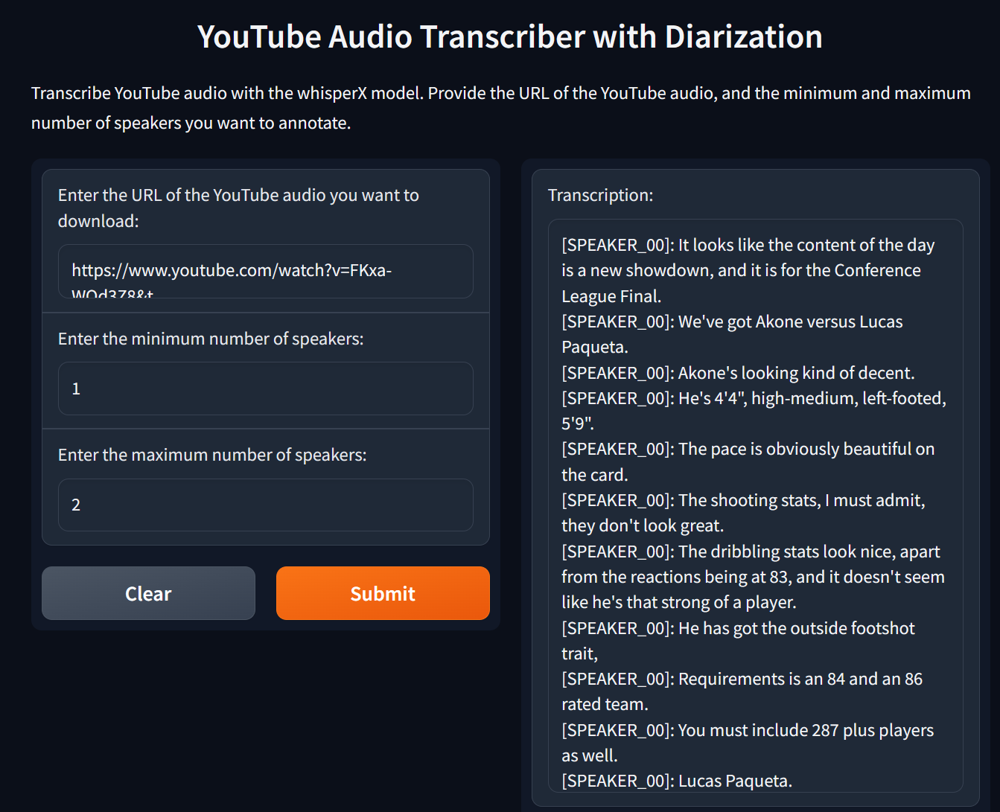

## Youtube captioning app using [yt-dlp](https://github.com/yt-dlp/yt-dlp) and  [WhisperX](https://github.com/m-bain/whisper) and Gradio.


App Demo: 


Install intructions: 
- Install [yt-dlp](https://github.com/yt-dlp/yt-dlp#installation) using their intallation process
- Install [WhisperX](https://github.com/m-bain/whisperX#setup-%EF%B8%8F) using their setup 
- Run ```pip install -r requirements.txt```